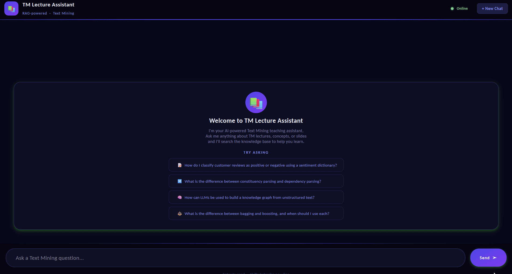

<div align="center">

# TM Section RAG

**Intelligent Text Mining Teaching Assistant with Retrieval Augmented Generation**

<div align="center">
  
  
  
  
  
</div>

**AI-powered semantic search and Q&A system for Text Mining lecture materials**

An intelligent teaching assistant that ingests lecture PDFs, builds a semantic vector database, and answers student questions with context-aware responses using advanced language models, complete with a modern PyQt6 interface.

</div>

---

## Table of Contents
- [Features](#features)
- [Demo](#demo)
- [Quick Start](#quick-start)
- [Installation](#installation)
- [Philosophy](#philosophy)
- [Project Architecture](#project-architecture)
- [Usage](#usage)
- [Project Structure](#project-structure)
- [Configuration](#configuration)
- [Data Pipeline](#data-pipeline)
- [Development](#development)
- [License](#license)

## Features

- **📚 PDF Ingestion**: Dual extraction modes—traditional OCR with PyMuPDF or Vision Language Model (VLM) for semantic understanding
- **🔍 Semantic Search**: Vector-based retrieval of contextually relevant lecture content
- **🤖 Intelligent Q&A**: Powered by Groq's advanced language models for accurate, citation-aware responses
- **💡 Context-Aware Answers**: Retrieves relevant lecture sections before generating responses
- **📍 Source Attribution**: Automatically cites sources (lecture name, section, slide number)
- **🎨 Modern UI**: Professional PyQt6 interface with dark theme and responsive design
- **⚡ Real-time Processing**: Instant semantic search with vector embeddings
- **🔐 Privacy-Focused**: Works locally with configurable backend services
- **📊 Metadata Preservation**: Tracks lecture structure, authors, and content relationships

## Demo

<div align="center">



*Interactive demonstration of the semantic search and Q&A capabilities with lecture retrieval*

</div>

## Quick Start

### Prerequisites
- Python 3.11 or higher
- Groq API key (free tier available at [groq.com](https://groq.com))
- Qdrant instance (Docker or cloud)
- Ollama with embeddinggemma model for embeddings (download at [ollama.ai](https://ollama.ai))

### Run the Application

```bash
# Install dependencies
uv sync
# or
pip install -r requirements.txt

# Set up environment variables
cp .env.example .env
# Edit .env with your Groq API key and Qdrant URL

# Launch the UI
python src/main.py
```

### First Use
1. **Ingest Lectures**: Use `scripts/process_pdfs.py` to process your lecture PDFs
2. **Build Vector Store**: Embeddings are automatically generated and stored
3. **Ask Questions**: Type queries in the chat interface and get instant context-aware responses

## Installation

### Requirements
- Python 3.11+
- 4GB+ RAM (8GB+ recommended)
- GPU optional but recommended for faster embeddings
- Qdrant instance (local Docker or cloud)
- Ollama with embeddinggemma model for embeddings

### Setup Steps

1. **Clone the repository**
   ```bash
   git clone <repository-url>
   cd tm-section-rag
   ```

2. **Create a virtual environment**
   ```bash
   python -m venv .venv
   
   # Activate (Windows)
   .venv\Scripts\activate
   
   # Activate (macOS/Linux)
   source .venv/bin/activate
   ```

3. **Install dependencies**
   ```bash
   # Using uv (recommended)
   uv sync
   
   # Or using pip
   pip install -r requirements.txt
   ```

4. **Configure environment**
   ```bash
   # Create .env file
   echo GROQ_API_KEY=your_api_key_here > .env
   echo QDRANT_URL=http://localhost:6333 >> .env
   echo OLLAMA_URL=http://localhost:11434 >> .env
   ```

5. **Set up Ollama with embeddinggemma model**
   ```bash
   # Install Ollama from https://ollama.ai, then pull Gemma
   ollama pull embeddinggemma:300m
   # Or for larger model: ollama pull qwen3-embedding:4b
   
   # Start Ollama server (default runs on http://localhost:11434)
   ollama serve
   ```

6. **Set up Qdrant (Docker)**
   ```bash
   docker-compose -f docker/compose.yml up -d
   ```

7. **Start the application**
   ```bash
   python src/main.py
   ```

## Philosophy

TM Section RAG was developed as an intelligent teaching assistant to make Text Mining concepts more accessible and engaging for students. We believe that:

**AI can enhance education** — By combining semantic search with language models, students get instant, context-aware explanations grounded in course material.

**Attribution matters** — Every response includes citations to specific lectures and slides, maintaining academic integrity and enabling deep-dive learning.

**Interface simplicity** — The clean PyQt6 UI focuses on core functionality: ask questions, get answers, review sources.

## Project Architecture

### System Overview

The application follows a modular RAG (Retrieval-Augmented Generation) pipeline:

```
PDF Input → Text Extraction → Embeddings → Vector Store → Query Processing → LLM → Response
              (Ingestion)     (Embedding)  (Qdrant)      (Retrieval)        (Groq)
```

### Component Architecture

**📥 Ingestion Layer** (`src/ingestion/`)
- **Two extraction modes**:
  - **PyMuPDF**: Fast text and image extraction with metadata preservation
  - **VLM (Vision Language Model)**: Semantic understanding of slides using Groq's vision models, ideal for complex diagrams and visual content
- Multi-page processing with automatic slide numbering
- Robust error handling and retry logic for rate limits

**🔢 Embedding Layer** (`src/embedding/`)
- **Ollama-powered embeddings** using embeddinggemma:300m model (local, privacy-preserving)
- Support for multiple embedding model sizes (300m, 4B, etc.)
- Efficient batch processing
- Cosine similarity-based retrieval

**🗄️ Storage Layer** (`src/store/`)
- Qdrant vector database integration
- Collection management and indexing
- Similarity search with configurable top-k retrieval

**🧠 Generation Layer** (`src/generation/`)
- Context augmentation from retrieval results
- LLM prompt engineering
- Structured response formatting

**🎨 UI Layer** (`src/main.py`)
- Modern PyQt6 chat interface
- Real-time message streaming
- Markdown rendering and code syntax highlighting

## Usage

### Processing New Lecture PDFs

#### Standard Method (PyMuPDF)

```bash
python scripts/process_pdfs.py --input lectures/ --output sections/
```

This script:
1. Extracts text from all PDFs using PyMuPDF and pdf2image
2. Preserves layout and metadata
3. Generates embeddings for each section
4. Stores vectors and metadata in Qdrant
5. Creates indexed sections for quick retrieval

#### Vision Language Model Method (VLM)

```bash
python scripts/process_pdfs.py --input lectures/ --output sections/ --use-vlm
```

Alternatively, use the VLM module directly:

```python
from ingestion.vlm import extract_pages_vlm
from groq import Groq

client = Groq(api_key="your_groq_api_key")
pages = extract_pages_vlm(client, "lecture.pdf")
# Returns dict with AI-enriched semantic descriptions of each slide
```

**When to use VLM:**
- Complex diagrams, flowcharts, and visual hierarchies that need semantic understanding
- Slides with mixed content (text + multiple visual elements)
- When accuracy for image-based information is critical

**Advantages:**
- ✅ Understands and describes visual relationships
- ✅ Extracts semantic meaning from diagrams
- ✅ Handles OCR-difficult layouts better
- ✅ Preserves conceptual relationships

**Trade-offs:**
- ⚠️ Slower processing (API call per slide)
- ⚠️ Requires active Groq API quota
- ⚠️ Rate limiting may apply for large PDFs

### Querying the System

#### Via GUI
1. Launch `python src/main.py`
2. Type your question in the input box
3. View retrieved sources and AI-generated response
4. Browse cited slide references

#### Via Python API
```python
from generation.generate import generate_response

query = "What are the main preprocessing techniques in text mining?"
response = generate_response(query)
print(response)
```

### Indexing Lecture Content

```bash
python scripts/index.py \
  --pdf-dir ./lectures \
  --collection-name TM_section_slides \
  --batch-size 32
```

## Project Structure

```
tm-section-rag/
├── src/
│   ├── main.py                          # PyQt6 GUI application entry point
│   ├── __init__.py
│   ├── embedding/
│   │   ├── __init__.py
│   │   └── embed.py                     # Text vectorization and embedding
│   ├── generation/
│   │   ├── __init__.py
│   │   └── generate.py                  # LLM prompt & response generation
│   ├── ingestion/
│   │   ├── __init__.py
│   │   ├── processing.py                # PDF extraction & parsing
│   │   └── vlm.py                       # Vision-language model utilities
│   ├── store/
│   │   ├── __init__.py
│   │   └── qdrant_store.py              # Vector database operations
│   └── utils/
│       ├── __init__.py
│       └── util.py                      # Helper functions & utilities
├── scripts/
│   ├── index.py                         # Batch indexing script
│   └── process_pdfs.py                  # PDF processing pipeline
├── sections/                            # Extracted lecture sections
├── assets/
│   └── demo.gif                         # Demonstration animation
├── docker/
│   └── compose.yml                      # Qdrant Docker configuration
├── pyproject.toml                       # Project metadata & dependencies
├── requirements.txt                     # Python dependencies
├── .env.example                         # Environment configuration template
├── LICENSE                              # MIT License
└── README.md                            # This file
```

## Configuration

### Environment Variables

Create a `.env` file in the project root:

```env
# Groq API Configuration
GROQ_API_KEY=your_groq_api_key_here

# Ollama Configuration (for embeddings)
OLLAMA_URL=http://localhost:11434
OLLAMA_EMBEDDING_MODEL=embeddinggemma:300m

# Qdrant Vector Database
QDRANT_URL=http://localhost:6333
QDRANT_API_KEY=optional_api_key

# Application Settings
COLLECTION_NAME=TM_section_slides
RETRIEVAL_TOP_K=5
LLM_MODEL=openai/gpt-oss-120b
LLM_TEMPERATURE=0.2
```

### Key Configuration Points

**Embedding Settings** (`src/embedding/embed.py`):
- Model: `embeddinggemma:300m` or `qwen3-embedding:4b` (via Ollama)
- Runs locally for privacy and cost-efficiency
- Default Ollama endpoint: `http://localhost:11434`
- Supports custom model sizes

**Retrieval Settings** (`src/generation/generate.py`):
- `top_k=5`: Number of relevant chunks to retrieve
- `similarity_threshold`: Minimum relevance score

**LLM Settings**:
- Model: `openai/gpt-oss-120b` (via Groq)
- Temperature: `0.2` (lower = more factual)
- Max tokens: Configurable per request

**Vector Database** (`src/store/qdrant_store.py`):
- Distance metric: Cosine similarity
- Vector size: 384 dimensions (MiniLM-L6-v2)
- Batch size: 32 documents

## Data Pipeline

### 1. PDF Processing (Two Options)

**Option A: Fast Extraction (PyMuPDF)**
```
PDF File → PyMuPDF → Extract Text & Images → Parse Metadata → Slide Objects
```

**Option B: Semantic Extraction (VLM)**
```
PDF File → Convert to Images → VLM Processing → Semantic Descriptions → Slide Objects
                                (Groq API)
```

### 2. Chunking & Embedding
```
Slides → Chunk Text → Send to Ollama → Generate Embeddings (embeddinggemma:300m) → Vector + Metadata → Storage
```

### 3. Retrieval
```
User Query → Embed Query → Semantic Search → Top-K Results → Context Building
```

### 4. Generation
```
Context + Query → Prompt Engineering → LLM API Call → Parse & Format → Response
```

## Development

### Running in Development Mode
```bash
# Start Qdrant
docker-compose -f docker/compose.yml up

# Run the application
python src/main.py
```

### Building Production Distribution

```bash
# Create executable
uv build
```

### Adding New Lecture Materials

1. Place PDF files in a dedicated directory
2. Choose your extraction method and run the indexing script:
   ```bash
   # Using PyMuPDF (default, faster)
   python scripts/index.py --pdf-dir ./new_lectures
   
   # Using VLM for semantic extraction (slower but better for complex visuals)
   python scripts/index.py --pdf-dir ./new_lectures --use-vlm
   ```
3. The UI will automatically detect new content
4. Vector embeddings are generated and stored in Qdrant

### Testing Retrieval Quality

```python
from generation.generate import add_context

# Test the context augmentation pipeline
test_query = "What is text mining?"
context = add_context(test_query)
print(context)
```

## Dependencies Overview

| Package | Purpose | Version |
|---------|---------|---------|
| **groq** | LLM API Client | >=1.2.0 |
| **qdrant-client** | Vector Database | >=1.17.1 |
| **pymupdf** | PDF Processing | >=1.27.2 |
| **pdf2image** | Image Extraction | >=1.17.0 |
| **PyQt6** | GUI Framework | >=6.11.0 |
| **pydantic** | Data Validation | >=2.13.3 |
| **python-dotenv** | Environment Config | >=1.2.2 |

## License

MIT License — see [LICENSE](LICENSE) file for details.

---